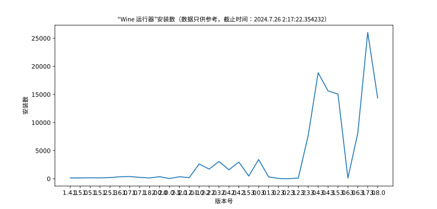
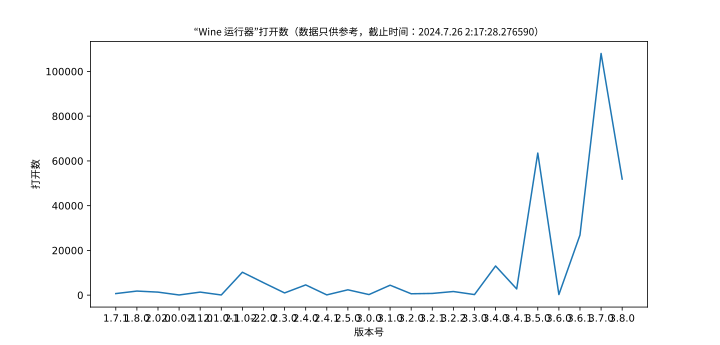
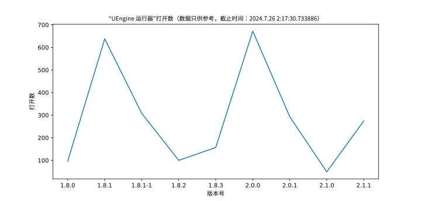

<script>
var _hmt = _hmt || [];
(function() {
  var hm = document.createElement("script");
  hm.src = "https://hm.baidu.com/hm.js?807ee27dfca59506248e7f74c812ca3d";
  var s = document.getElementsByTagName("script")[0]; 
  s.parentNode.insertBefore(hm, s);
})();
</script>

# 作品列表
- 自建 apt 软件源
- UEngine 运行器（最新版本 2.0.1）
- Wine 运行器（最新版本 3.2.1）
- spark-webapp-runtime-runner 运行器（最新版本 1.1.0）
- Deepin Community Live CD（最新版本 1.7.0）
- ……

# 自建 apt 软件源
详细可见：https://gitee.com/gfdgd-xi/apt-packages-websize-program/issues  
## 如何添加该 apt 源？
```bash
wget https://code.gitlink.org.cn/gfdgd_xi/apt-packages-program/raw/branch/master/sources/gitlink.sh; bash gitlink.sh; rm gitlink.sh
```

# UEngine 运行器（最新版本 2.0.1）
新版本Deepin/UOS发布后，可以在应用商店安装部分官方已适配的安卓应用，对爱好者来说，不能自己安装APK软件包始终差点意思，本程序可以为Deepin/UOS上的UEngine安卓运行环境安装自定义APK软件包，并能发送安装的APK包启动菜单到桌面或系统菜单。   
**本程序依照 GPLV3 协议开源**  
**想要在线获取 UEngine 运行器评分功能的结果？可见：[https://gfdgd-xi.github.io/uengine-runner-info](uengine-runner-info)**  
程序的部分工作原理可见：[https://www.52pojie.cn/thread-1672077-1-1.html](https://www.52pojie.cn/thread-1672077-1-1.html)  
[](https://gitee.com/gfdgd-xi/deep-wine-runner)  
  
[点此查看更多关于这个程序的介绍](https://gfdgd-xi.github.io/uengine-runner/)和[这个程序的帮助](https://gfdgd-xi.github.io/uengine-runner/Help)  
[](https://gitee.com/gfdgd-xi/uengine-runner/stargazers)  
## 在 Deepin 23 Alpha2 安装 UEngine 运行器？
> 例如：https://gitee.com/gfdgd-xi/uengine-runner/issues/I6MBBC  

需要从以下链接补充依赖：  
https://gfdgdxi.lanzoue.com/b01qiu22f  
密码:dihl  
## 下载链接
蓝奏云：[https://gfdgdxi.lanzoui.com/b01oaxnbi](https://gfdgdxi.lanzoui.com/b01oaxnbi)，密码：[2rh3](https://gfdgdxi.lanzoui.com/b01oaxnbi)  
Github：[https://github.com/gfdgd-xi/uengine-runner](https://github.com/gfdgd-xi/uengine-runner)  
Gitee：[https://gitee.com/gfdgd-xi/uengine-runner](https://gitee.com/gfdgd-xi/uengine-runner)  
星火应用商店：spk://store/tools/spark-uengine-runner  
软件源更新：使用方法见下  
UEngine 运行器内部更新：可以使用 UEngine 运行器自带的更新程序进行更新（只支持 1.6.0 及以上版本）  

# Wine 运行器（最新版本 3.2.1）
Wine运行器是一个能让Linux用户更加方便地运行Windows应用的程序，内置了对Wine图形化的支持、各种Wine工具、自制的Wine程序打包器和运行库安装工具等。  
它同时还内置了基于VirtualBox制作的、专供小白使用的Windows虚拟机安装工具，可以做到只需下载系统镜像并点击安装即可，无需考虑虚拟机的安装、创建、分区等操作。  
此外，它还简化了如下命令，让你可以更简便地使用Wine：  
```bash
env WINEPREFIX=容器路径 wine（wine的路径） 可执行文件路径
```
让你可以简易方便的使用 wine。  
Wine 运行器吾爱专版和 Wine 运行器部分组件工作原理可见：[https://www.52pojie.cn/thread-1675552-1-1.html](https://www.52pojie.cn/thread-1675552-1-1.html)  
**本程序依照 GPLV3 协议开源**  
**想要在线获取 Wine 运行器评分功能的结果？可见：[https://gfdgd-xi.github.io/wine-runner-info](wine-runner-info)**  
**程序 Wiki 可见：[https://gfdgd-xi.github.io/wine-runner-wiki](wine-runner-wiki)**  
[](https://gitee.com/gfdgd-xi/deep-wine-runner)  
  
更多软件介绍均可见下方 Gitee、Github、Gitlink 下载链接  
[](https://gitee.com/gfdgd-xi/deep-wine-runner/stargazers)  
# 在 Openkylin 如何安装？
首先添加作者的源：  
Gitlink 源（国内推荐）：  
```bash
wget https://code.gitlink.org.cn/gfdgd_xi/gfdgd-xi-apt-mirrors/raw/branch/master/sources/gitlink.sh && bash gitlink.sh && rm gitlink.sh
```
Github 源（国外推荐）：  
```bash
wget https://gfdgd-xi.github.io/gfdgd-xi-apt-mirrors/sources/github.sh && bash github.sh && rm github.sh
```
上面二选一，添加完后执行  
```bash
sudo apt install spark-deepin-wine-runner
```
即可自动补全依赖安装（说实话 openkylin 缺的依赖好多）  
## 下载链接
Gitee：[https://gitee.com/gfdgd-xi/deep-wine-runner](https://gitee.com/gfdgd-xi/deep-wine-runner)  
Github：[https://github.com/gfdgd-xi/deep-wine-runner](https://github.com/gfdgd-xi/deep-wine-runner)  
Gitlink：[https://www.gitlink.org.cn/gfdgd_xi/deep-wine-runner](https://www.gitlink.org.cn/gfdgd_xi/deep-wine-runner)  
蓝奏云：[https://gfdgdxi.lanzouj.com/b01nz7y3e](https://gfdgdxi.lanzouj.com/b01nz7y3e)，密码:[7oii](https://gfdgdxi.lanzouj.com/b01nz7y3e)  
软件源更新：使用方法见下  
星火应用商店：[spk://store/tools/spark-deepin-wine-runner](spk://store/tools/spark-deepin-wine-runner)  

# spark-webapp-runtime-runner 运行器（最新版本1.1.0）
一个 spark-webapp-runtime（星火网页应用运行环境）图形化运行器，可以让你更加方便的使用星火网页应用运行环境  
**本程序依照 GPLV3 协议开源**  
   
更多软件介绍均可见下方 Gitee、Github、Gitlink 下载链接  
[](https://gitee.com/gfdgd-xi/spark-webapp-runtime-runner/stargazers)  
## 下载链接
Gitee：[https://gitee.com/gfdgd-xi/spark-webapp-runtime-runner](https://gitee.com/gfdgd-xi/spark-webapp-runtime-runner)  
Github：[https://github.com/gfdgd-xi/spark-webapp-runtime-runner](https://github.com/gfdgd-xi/spark-webapp-runtime-runner)  
Gitlink：[https://gitlink.org.cn/gfdgd_xi/spark-webapp-runtime-runner](https://gitlink.org.cn/gfdgd_xi/spark-webapp-runtime-runner)  
蓝奏云：[https://gfdgdxi.lanzouj.com/b01nzcuqd](https://gfdgdxi.lanzouj.com/b01nzcuqd)，密码:[awcg](https://gfdgdxi.lanzouj.com/b01nzcuqd)  
星火应用商店：[spk://store/tools/spark-webapp-runtime-runner](spk://store/tools/spark-webapp-runtime-runner)
# Deepin Community Live CD（最新版本 1.7.0）
此 Live CD 基于 deepin 20.7 和原 Live CD 2.0 制作，安装部分维护工具（如果还有需要添加的就说），感谢 [https://bbs.deepin.org/post/166409](https://bbs.deepin.org/post/166409) 的作者   [@xchngg](https://bbs.deepin.org/user/108842)的参考文档，本 Live CD 1.2.1 及以前版本使用该方案打包，测试 Ventoy 在 Legacy 和 UEFT 模式下均可运行此 Live CD，有常用驱动（网卡、显卡、声卡），理论上能运行 deepin 20.7 均可运行  
同时也借鉴了以下文章的内容：  
[https://bbs.deepin.org/post/228930](https://bbs.deepin.org/post/228930) [@deepin-superuser](https://bbs.deepin.org/user/278484)  

[https://bbs.deepin.org/post/228568](https://bbs.deepin.org/post/228568)  [@木一明](https://bbs.deepin.org/user/160805)  

**full 用户密码（包括root密码）为：123456**  
**tiny、mini、install root 密码未知**  


## 下载链接
鹤川云盘：https://pan.hechuanyun.xyz/s/Weua  

百度网盘：链接: [https://pan.baidu.com/s/1n5J8M8iqfI-kMbmHfR-x9w](https://pan.baidu.com/s/1n5J8M8iqfI-kMbmHfR-x9w) 提取码: ejr7  


阿里云盘（要改后缀名，出问题无法正常下载）：[https://www.aliyundrive.com/s/bfzZhFWCEdi](https://www.aliyundrive.com/s/bfzZhFWCEdi)  
和彩云：链接: [https://caiyun.139.com/m/i?0r5CLA9upgtMT](https://caiyun.139.com/m/i?0r5CLA9upgtMT) 提取码:nEy6  

天翼云盘：https://cloud.189.cn/t/3IR3m2RrQ7je，访问码:uzl1  

# 程序下载量
## Wine 运行器

## UEngine 运行器

# 程序打开量
## Wine 运行器

## UEngine 运行器

# 程序最新版本更新日志
## UEngine 运行器（最新版本 2.0.1）
**※1、新增移除在 Ubuntu 上安装的 UEngine 及其附属脚本的功能**  
**※2、优化 Ubuntu 安装器启用和安装逻辑，不允许在 UOS/Deepin 安装移植的 Ubuntu UEngine**  
**※3、Ubuntu 安装器不允许在非 X86 架构上使用**  
**※4、在升级/安装运行器的 deb 时会自动移除安装错误的 UEngine 生成的脚本**  
**※5、Ubuntu 安装器进行环境监测**  
**※6、修复应用商店换源问题（由@Bail修复）**  
7、修改作者信息  
8、更新使用帮助  
9、关于窗口修复系统失败错误的问题并新增安装包构建时间  
10、移除赞赏功能  
11、微型应用商店适配了更新关闭进程（由@Bail实现）  


  
[](https://gitee.com/gfdgd-xi/uengine-runner/stargazers)  

## Wine 运行器（最新版本 3.2.1）
**※1、Windows 虚拟机安装工具支持非 X86 架构；**  
**※2、应用打包器可以与星火应用商店配合构建 arm/all 全架构的 Wine 包；**  
**※3、Windows 虚拟机安装工具支持调用 Qemu；**  
**※4、新增 Qemu User 运行 Wine 的帮助入口；**  
**※5、修复 Windows 虚拟机的自动配置镜像缺少 aria2c.exe 的故障；**  
**※6、支持在更新程序版本时自动关闭程序进程；**  
7、运行器和打包器支持调用 spark-wine8；  
8、修改作者信息；  
9、新增安装包构建时间；  
10、优化 Wine 运行器更新策略。  

  
[](https://gitee.com/gfdgd-xi/deep-wine-runner/stargazers)  

### spark-webapp-runtime-runner 运行器（最新版本1.1.0）
※1、程序全部重构，语言从 Python 转 C++、GUI 从 Tkinter 转 DTK、布局大改，参考了 sgb76 大佬的 Wine 运行器设计图、zty79的桌面快捷方式编辑器的参考布局  
※2、程序新增打包功能  
   
[](https://gitee.com/gfdgd-xi/spark-webapp-runtime-runner/stargazers)  
### Deepin Community Live CD（最新版本 1.7.0）
1、升级为基于 20.7，支持最新的 5.18.4-amd-desktop-hwe 内核  
2、修复星火源签名问题（且换成镜像源以提高安装速度）  
3、新增 15.11 版本  
**full最新 1.7.0，install 最新 1.7.0，mini最新1.7.0，tiny最新1.2.0-1，install版暂未更新**  
# Deepin Community Live CD 版本列表
<table>
<thead>
<tr>
<th align="center">版本号</th>
<th align="center">tiny</th>
<th align="center">mini</th>
<th align="center">full</th>
<th align="center">install</th>
<th align="center">tiny(本地版本)</th>
<th align="center">mini(本地版本)</th>
<th align="center">full(本地版本)</th>
<th align="center">install(本地版本)</th>
<th align="center">15.11</th>
<th align="center">23</th>
<th align="center">debian11-i386</th>
<th align="center">debian11-amd64</th>
<th align="center">debian11-armhf</th>
<th align="center">debian11-arm64</th>
</tr>
</thead>
<tbody>
<tr>
<td align="center">1.7.0</td>
<td align="center"></td>
<td align="center">●</td>
<td align="center">●</td>
<td align="center">●</td>
<td align="center">●</td>
<td align="center">●</td>
<td align="center">●</td>
<td align="center"></td>
<td align="center">●</td>
<td align="center"></td>
</tr>
<tr>
<td align="center">1.6.0</td>
<td align="center">●</td>
<td align="center">●</td>
<td align="center">●</td>
<td align="center">●</td>
<td align="center">●</td>
<td align="center">●</td>
<td align="center">●</td>
<td align="center"></td>
<td align="center">●</td>
<td align="center"></td>
</tr>
<tr>
<td align="center">1.5.0</td>
<td align="center"></td>
<td align="center"></td>
<td align="center"></td>
<td align="center">●</td>
<td align="center"></td>
<td align="center"></td>
<td align="center"></td>
<td align="center"></td>
<td align="center"></td>
<td align="center"></td>
</tr>
<tr>
<td align="center">1.4.0</td>
<td align="center">●</td>
<td align="center">●</td>
<td align="center">●</td>
<td align="center"></td>
<td align="center">●</td>
<td align="center">●</td>
<td align="center">●</td>
<td align="center"></td>
<td align="center">●</td>
<td align="center">×</td>
</tr>
<tr>
<td align="center">1.3.0</td>
<td align="center"></td>
<td align="center"></td>
<td align="center">●</td>
<td align="center"></td>
<td align="center"></td>
<td align="center"></td>
<td align="center"></td>
<td align="center"></td>
<td align="center"></td>
<td align="center"></td>
</tr>
<tr>
<td align="center">1.2.1</td>
<td align="center"></td>
<td align="center">●</td>
<td align="center">●</td>
<td align="center">●</td>
<td align="center"></td>
<td align="center">●</td>
<td align="center"></td>
<td align="center"></td>
<td align="center"></td>
<td align="center"></td>
</tr>
<tr>
<td align="center">1.2.0</td>
<td align="center">●</td>
<td align="center">●</td>
<td align="center">●</td>
<td align="center">●</td>
<td align="center">●</td>
<td align="center">●</td>
<td align="center">●</td>
<td align="center">●</td>
<td align="center"></td>
<td align="center"></td>
</tr>
<tr>
<td align="center">1.1.1</td>
<td align="center"></td>
<td align="center"></td>
<td align="center">●</td>
<td align="center"></td>
<td align="center"></td>
<td align="center"></td>
<td align="center"></td>
<td align="center"></td>
<td align="center"></td>
<td align="center"></td>
</tr>
<tr>
<td align="center">1.1.0</td>
<td align="center">●</td>
<td align="center">●</td>
<td align="center">●</td>
<td align="center"></td>
<td align="center">●</td>
<td align="center">●</td>
<td align="center">●</td>
<td align="center"></td>
<td align="center"></td>
<td align="center"></td>
</tr>
<tr>
<td align="center">1.0.5</td>
<td align="center"></td>
<td align="center"></td>
<td align="center">×</td>
<td align="center"></td>
<td align="center"></td>
<td align="center"></td>
<td align="center"></td>
<td align="center"></td>
<td align="center"></td>
<td align="center"></td>
</tr>
<tr>
<td align="center">1.0.4</td>
<td align="center"></td>
<td align="center"></td>
<td align="center">●</td>
<td align="center"></td>
<td align="center"></td>
<td align="center"></td>
<td align="center"></td>
<td align="center"></td>
<td align="center"></td>
<td align="center"></td>
</tr>
<tr>
<td align="center">1.0.3</td>
<td align="center"></td>
<td align="center"></td>
<td align="center">●</td>
<td align="center"></td>
<td align="center"></td>
<td align="center"></td>
<td align="center"></td>
<td align="center"></td>
<td align="center"></td>
<td align="center"></td>
</tr>
<tr>
<td align="center">1.0.2</td>
<td align="center"></td>
<td align="center"></td>
<td align="center">●</td>
<td align="center"></td>
<td align="center"></td>
<td align="center"></td>
<td align="center"></td>
<td align="center"></td>
<td align="center"></td>
<td align="center"></td>
</tr>
<tr>
<td align="center">1.0.1</td>
<td align="center"></td>
<td align="center"></td>
<td align="center">●</td>
<td align="center"></td>
<td align="center"></td>
<td align="center"></td>
<td align="center"></td>
<td align="center"></td>
<td align="center"></td>
<td align="center"></td>
</tr>
<tr>
<td align="center">1.0.0-rc</td>
<td align="center"></td>
<td align="center"></td>
<td align="center">●</td>
<td align="center"></td>
<td align="center"></td>
<td align="center"></td>
<td align="center"></td>
<td align="center"></td>
<td align="center"></td>
<td align="center"></td>
</tr>
<tr>
<td align="center">1.0.0-beta</td>
<td align="center"></td>
<td align="center"></td>
<td align="center">●</td>
<td align="center"></td>
<td align="center"></td>
<td align="center"></td>
<td align="center"></td>
<td align="center"></td>
<td align="center"></td>
<td align="center"></td>
</tr>
</tbody></table>
# Deepin Community Live CD 具体版本划分
## tiny 版

（当然大小并不 tiny）只是在原版 Live CD 升级了内核，没有多的更新，也没有重新打包（所以壁纸也没有换），适用于应急或者空间、网速以及对功能要求不高且电脑配置较低以及语言非简体中文的用户  
目前只更新到 1.2.0 版本  


## mini 版

在 tiny 版本的基础上，更新并预装了部分原来没有的应用，目前 1.1.0-mini 新预装了 vim、timeshift，将 lights-firefox 升级为 firefox，适用于嫌弃 full 版本空间大以及 tiny 版本功能不全和电脑配置较低以及语言非简体中文的用户  


## full 版

（和上面两个版本无关）基于 deepin 20.7 打包，功能较为完整、预装程序也比较多，但无法选择语言（即不能和 tiny、mini 版本一样启动选择语言），如果没有特殊的问题，建议使用这个版本  


## install

基于 deepin 20.6 打包，功能非常完整，并未精简过多应用，支持直接运行系官方的安装向导，但无法选择语言（即不能和 tiny、mini 版本一样启动选择语言），以及安装出来的系统会和这个 Live CD 一样被修改过，如果没有特殊的问题，建议使用使用原版镜像进行系统安装  


# 15.11 版

基于 deepin 15.11 制作，满满的回忆  
比 full 版本的功能少一点，因为 Deepin 15.11 的底层有些老  


<h1 id="copyright">©2020~Now gfdgd xi</h1>
<script>
var d = new Date();
document.getElementById("copyright").innerHTML="©2020~" + d.getFullYear() + " gfdgd xi";
</script>
